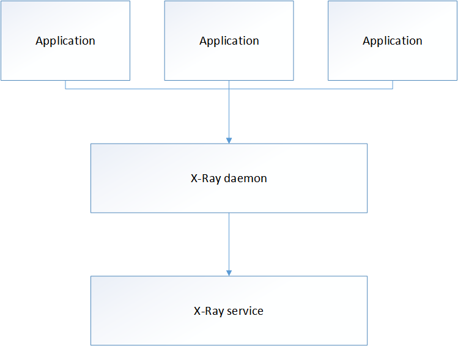
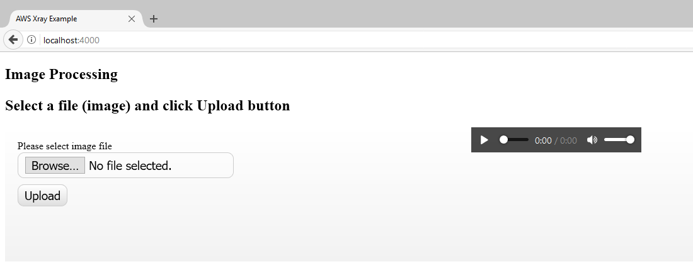
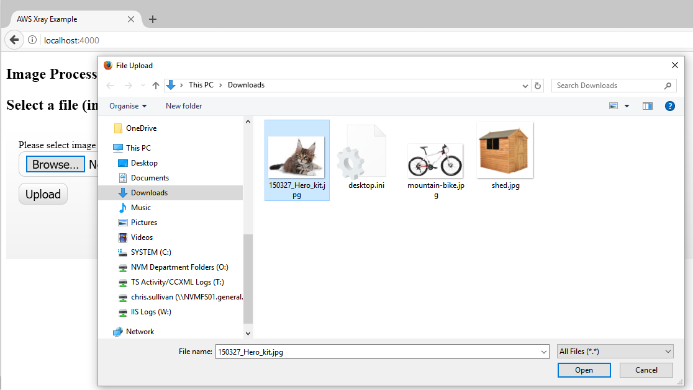
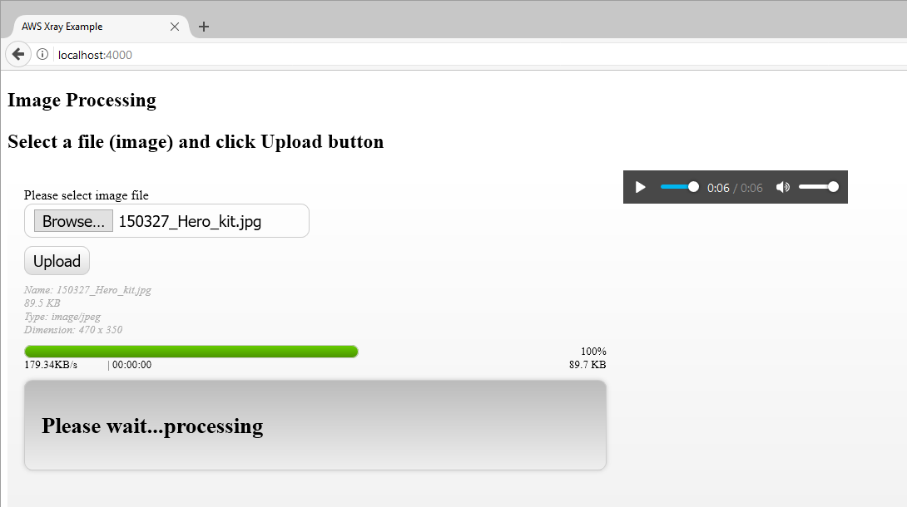
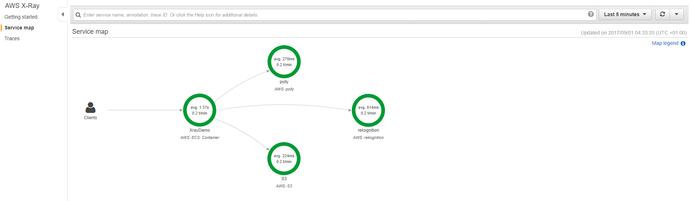
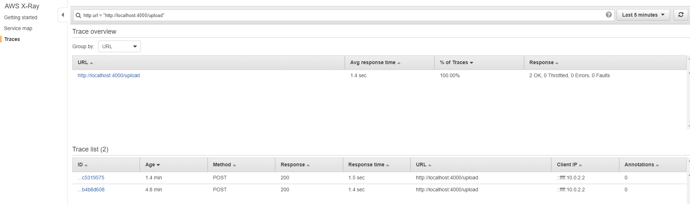
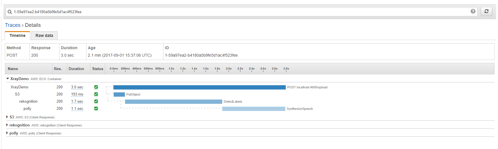
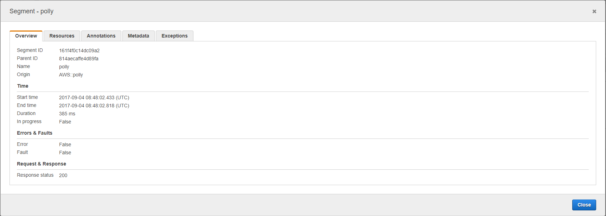

# Amazon Web Services XRAY ![aws-badge]
> Example application that uses AWS services S3, Rekognition and Polly to demonstrate XRAY 

## Background

Amazon's Application Load Balancer (ALB) can log all requests and store data in an S3 bucket, see http://docs.aws.amazon.com/elasticloadbalancing/latest/application/load-balancer-access-logs.html

However, when using many microservices it is useful to trace the entire request throught the stack. When the Amazon ALB load balancer receives a request from a client, it adds or updates the X-Amzn-Trace-Id header before sending the request to the target. Any services or applications between the load balancer and the target can also add or update this header.

If you don't use the Amazon ALB and use a reverse proxy or other kind of load balancer is it probably a good idea to create a home grown version of the trace header. Each microservice can then update the header which means you can see which services your request went to and calculate any latency.

When you have the request data you can perform necessary calculations using your favourite analysis tools or like me, you'll probably want to visualise the service calls.

## Enter Amazon Web Services X-Ray

X-Ray is a service from Amazon that will help you visualise your request through many services, for more information see https://aws.amazon.com/xray/.

Because X-Ray is a service you do not need to host your servers on Amazon's EC2 in order to use it, the servers can be hosted anywhere, even on premise. Communication with the X-Ray service is via the X-Ray SDK or AWS SDK so you will still need an AWS account with credentials and permissions to make calls to the X-Ray API.

## How does X-Ray work?

The easiest way to use X-Ray is to via the X-Ray SDK (although you can also use the AWS SDK).

Currently the X-Ray SDK is only supported for the following languages
* Java
* Node
* C# .Net

The X-Ray SDK library needs to be included as part of your application, the exact integration is well documented on the AWS web sites; I chose Node/Express because it is easy to add the AWS X-Ray SDK as a middleware component - something that I'm comfortable with having used similar libraries with Rack/Ruby.

When using the X-Ray SDK your application will send out a UDP message to localhost (127.0.0.1). The UDP message will be picked up by an X-Ray daemon and forwarded to the X-Ray service. The X-Ray daemon does not have to be on the same host as your application and can be running in a Docker container. One thing to note, if the X-Ray daemon is not running on the same host as your application or the X-Ray daemon is running in a Docker container your environment will have to override the default address for the UDP traffic by setting AWS_XRAY_DAEMON_ADDRESS; see http://docs.aws.amazon.com/xray/latest/devguide/xray-sdk-nodejs-configuration.html and https://www.npmjs.com/package/aws-xray-sdk-core 



The AWS X-Ray SDK needs to access AWS X-Ray service so you will need an AWS account and permissions to write to the X-Ray service. If you are running the X-Ray SDK on an Amazon EC2 instance then you can give the instance a Role and apply the appropriate permissions, the SDK will read the instance metadata (instance metadata can be obtained by querying http://169.254.169.254, see: http://docs.aws.amazon.com/AWSEC2/latest/UserGuide/ec2-instance-metadata.html) or shared credentials (i.e. a .aws folder containing credentials file) or environment variables. The methods for obtaining AWS credentials (as just described) are standard for all AWS SDK's, the aws command line interface (cli) explains the options in more detail: http://docs.aws.amazon.com/cli/latest/userguide/cli-chap-getting-started.html 

The quickest way to view a demonstration of AWS X-Ray is to log in to the AWS console, select X-Ray and use the Getting started application which is loaded as an AWS Lambda function.

This Github repo contains an equally quick way to demonstrate X-Ray which is hopefully more fun!

## Pre-requisites

To view this demonstration you will need
* VirtualBox which can be downloaded from here: https://www.virtualbox.org/wiki/Downloads
* Vagrant which can be downloaded from here: https://www.vagrantup.com/downloads.html
* An AWS account or credentials

Tested with VirtualBox 5.1.26
Tested with Vagrant 1.9.8

Host operating system: Windows 10 creators edition

## The demonstration

The demonstration application is written in Node using the Express framework, see https://expressjs.com/

The solutions file structure is kept intentionally simple and does not follow any particular format or standard layout for an Express application. If you want a quick start for Node and Express using a conventional file layout I'd recommend a generator program such as express-generator (see: https://expressjs.com/en/starter/generator.html) or Yeoman (see: http://yeoman.io/)

X-Ray can trace messages through your entire microservice stack AND the AWS services, this demonstration contains a single microservice but utilises the following AWS services
* Simple Storage Service (S3, see https://aws.amazon.com/s3/)
* Rekognition (see https://aws.amazon.com/rekognition/)
* Polly (see https://aws.amazon.com/polly/)

The idea is that we upload an image which is analysed by Rekognition and described in words by Polly.

## Setting up and running the demonstration

After installing VirtualBox and Vagrant (in that order), download or fork the contents of this repo to your machine, open a command window and type

```
vagrant up
```

This will download an Ubuntu VM and install it with everything you need to get started which includes Node and the AWS CLI tools, when the command prompt returns we need to perform some manual steps, these steps could not be automated as they require YOUR AWS credentials.

Log in to the VM with (NB: on a Windows machine you'll need SSH.exe, if you have git installed SSH.exe should also be installed)

```
vagrant ssh
```

Or use PUTTY, simply download PUTTY, open PUTTY, select 127.0.0.1 as the host. The host port can be obtained by opening the VirtualBox manager, selecting the VM, choose settings, Network, Advanced, port forwarding, look for the host setting for SSH port.

After logging in to the VM you need to do the following

```
sudo su -
aws configure
export AWS_REGION="eu-west-1"
cd /opt/express/xray
./xray --log-level dev --log-file /var/log/xray-daemon.log &
cd /opt/express/awsservices
npm install
npm start
```

After typing aws configure you will be prompted for your AWS credentials so be ready and have them to hand.

The end result should be an Express web application up and running awaiting your instructon!

## Using the demonstration

If all has gone well, the Express web application will be up and running.

On your host open a browser and enter http://localhost:/4000

You should be presented with the following



Click on the "Browse" button, a dialog will appear and allow you to select an image



Click on the "Upload" button, if all goes well and the services respond you should get the description of the image loaded into the audio control which automatically starts to play.



Onto the main event, lets look at the result as seen by AWS X-Ray!

Log in to the AWS console, select X-Ray, if it is your first time using X-Ray click getting started and then cancel, don't worry you can run the getting started program anytime.

Click on the service map, it may take a few moments to generate but hopefully look similar to below



If you do not have a service map then something went wrong, did you get an audio description of your image?

In case of failure the first port of call is to look at the output of the Node application followed by X-Ray daemon logs.

The service map gives a visual overview of the calls to each service, in the case of the demonstration program that is AWS S3, Rekognition and Polly.

X-Ray displays the different URL's that were used to call the services in the traces section



From the tracing section you can dig down into the low level detail to view response times.



The individual components that make up the request can be viewed in even greater depth.



Feel free to amend the program, add more microservices or AWS services but above all have fun!

## Contributing
Please see [CONTRIBUTING.md][contributor] and read the [CODE_OF_CONDUCT.md][conduct]

## License
MIT © [Chris Sullivan]()

[aws-badge]: https://img.shields.io/badge/AWS-XRAY-green.svg
[contributor]: https://github.com/chrisgit/aws-xray_rekognise_polly/blob/master/CONTRIBUTING.md
[conduct]: https://github.com/chrisgit/aws-xray_rekognise_polly/blob/master/CODE_OF_CONDUCT.md
[licence]: https://github.com/chrisgit/aws-xray_rekognise_polly/blob/master/LICENSE